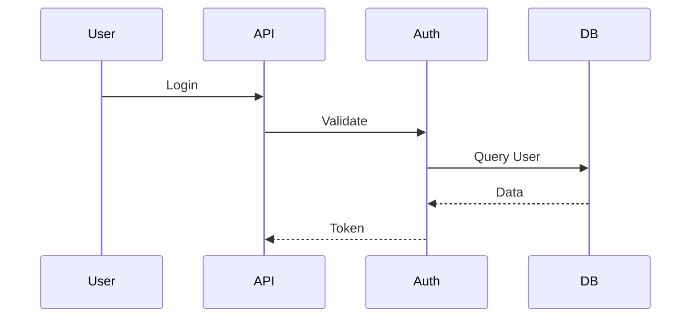

# AI Software Engineer Agent - Parte 42

# Project Knowledge Base: documentazione viva, conoscenza strutturata del progetto e aggiornamento automatico

## Obiettivo

Definire il sistema che mantiene una rappresentazione sempre aggiornata del progetto.

La memoria della Parte 41 conserva informazioni.

La Knowledge Base invece organizza la conoscenza in una forma utilizzabile dagli agenti.

La differenza:

```text
Memory:

"Ho visto questa informazione"


Knowledge Base:

"So come questa informazione si collega al progetto"
```

---

# Principio fondamentale

La documentazione tradizionale è passiva.

Esempio:

```text
README.md

(creato all'inizio)

↓

dopo 6 mesi

↓

probabilmente obsoleto

```

---

La Project Knowledge Base è attiva:

```text
Modifica codice

↓

Analisi impatto

↓

Aggiornamento documentazione

↓

Validazione coerenza

```

---

# Architettura Knowledge Base

```text
                    Repository


                         |


              Knowledge Extraction


                         |

 +-----------------------+-----------------------+

 |                       |                       |

Architecture         Technical             Domain

Knowledge            Knowledge             Knowledge


 |                       |                       |

 +-----------------------+-----------------------+

                         |

                  Knowledge Graph


                         |

                    AI Agents

```

---

# 1. Differenza tra Memory e Knowledge Base

## Memory

Risponde:

> "Cosa è successo?"

Esempio:

```text
Il 10 luglio è stato modificato auth.py.
```

---

## Knowledge Base

Risponde:

> "Come funziona il sistema?"

Esempio:

```text
auth.py gestisce autenticazione JWT.
Dipende da user_service.
Viene usato da API Gateway.
```

---

# 2. Struttura della Knowledge Base

All'interno:

```text
.ai/

knowledge/

├── architecture/

│   ├── components.md

│   ├── flows.md

│   └── diagrams.md


├── technology/

│   ├── stack.md

│   └── dependencies.md


├── domain/

│   ├── entities.md

│   └── business_rules.md


├── api/

│   ├── endpoints.md

│   └── contracts.md


└── patterns/

    └── coding_patterns.md

```

---

# 3. Architecture Knowledge

Descrive il sistema.

Esempio:

```markdown
# Authentication Architecture


Components:

- Auth Service

- JWT Manager

- User Repository


Flow:


Client

↓

API Gateway

↓

Auth Service

↓

Database

```

---

# 4. Component Catalog

Ogni componente viene registrato.

---

Esempio:

```yaml
component:

PaymentService


type:

backend_service


responsibility:

Handle payment transactions


dependencies:

- UserService

- PaymentProvider


risk:

high

```

---

# 5. Data Knowledge

L'agente deve conoscere i dati.

---

Esempio:

```markdown
# User Entity


Fields:

id

email

password_hash

created_at


Relations:

User -> Orders

```

---

Serve per evitare modifiche errate.

---

# 6. API Knowledge

La KB mantiene il contratto API.

---

Esempio:

```yaml
endpoint:

POST /login


input:

email

password


output:

JWT token


errors:

401

403

```

---

Se il Coder modifica l'API:

la KB viene aggiornata.

---

# 7. Business Rules Knowledge

Molto importante nei progetti grandi.

---

Esempio:

```markdown
# Discount Rules


VIP users receive 20% discount.


Discount cannot exceed 50%.

```

---

Il codice può cambiare.

La regola rimane.

---

# 8. Knowledge Graph

La parte più avanzata.

Il progetto viene rappresentato come grafo.

---

Esempio:

```text

User

 |

uses

 |

Authentication Service

 |

depends

 |

JWT Library

```

---

Nodi:

* classi;
* funzioni;
* moduli;
* database;
* API;
* regole.

---

Relazioni:

* depends_on;
* calls;
* implements;
* extends;
* modifies.

---

# 9. Automatic Knowledge Extraction

Processo:

```text
Repository Scan

↓

AST Analysis

↓

Dependency Analysis

↓

Semantic Extraction

↓

Knowledge Update

```

---

# 10. Knowledge Validation

La documentazione non deve essere generata senza controllo.

---

Esempio:

Documento:

```text
Authentication uses OAuth
```

---

Codice:

```text
JWT

```

---

Sistema:

```text
INCONSISTENCY FOUND

```

---

# 11. Contradiction Detection

L'agente deve trovare conflitti.

---

Esempio:

architecture.md:

```text
Database:

PostgreSQL

```

---

docker-compose:

```text
MongoDB

```

---

Segnalazione:

```text
Architecture mismatch

Requires review

```

---

# 12. Documentation Agent

Agente specializzato.

Responsabilità:

* aggiornare documenti;
* creare diagrammi;
* mantenere consistenza.

---

Workflow:

```text
Code Change

↓

Documentation Agent

↓

Update KB

↓

Validate

```

---

# 13. Diagram Generation

Genera:

* UML;
* component diagram;
* sequence diagram.

---

Esempio:



---

# 14. Project Onboarding

Funzione molto utile.

Nuovo sviluppatore:

> "Spiegami il progetto"

---

L'agente genera:

```markdown
# Project Overview


Purpose:

Ecommerce platform


Architecture:

Backend + Frontend + Database


Main modules:

- Auth

- Products

- Orders

```

---

# 15. Impact Analysis tramite Knowledge Base

Prima di modificare:

domanda:

> Cosa rischio di rompere?

---

La KB risponde:

```text
Changing User model affects:

- Authentication

- Orders

- Profile API

- Database migration

```

---

# 16. Knowledge Lifecycle

Ogni informazione ha stato.

---

Esempio:

```yaml
knowledge:

JWT authentication


status:

active


created:

2026-07-11


last_verified:

2026-07-15

```

---

# 17. Knowledge Confidence

Non tutte le informazioni sono certe.

---

Esempio:

```yaml
fact:

Payment uses Stripe


confidence:

0.95

```

---

Se deriva da ipotesi:

```yaml
confidence:

0.40

```

---

# 18. Integration con Planner

Il Planner usa la KB per:

* capire architettura;
* creare task;
* valutare impatto.

---

Esempio:

Richiesta:

> Aggiungi notifiche

Planner:

```text
Existing architecture:

Notification module absent.

Need:

- service

- database table

- API

```

---

# 19. Integration con Coder

Il Coder riceve:

```json
{

architecture_rules:

[

"Services cannot access database directly"

],


affected_components:

[

"NotificationService"

]

}

```

---

# 20. Integration con Tester

Il Tester usa:

* flussi;
* contratti API;
* business rules.

---

Esempio:

Regola:

```text
User cannot delete active subscription

```

Genera test.

---

# 21. Integration con Research Agent

La KB contiene decisioni.

Il Research Agent aggiorna:

* nuove tecnologie;
* alternative;
* ADR.

---

# 22. LangGraph Integration

Nodo:

```python
graph.add_node(
"knowledge_manager"
)

```

---

Workflow:

```text

Repository

↓

Knowledge Extraction

↓

Knowledge Base

↓

Planner

↓

Coder

```

---

# 23. LangSmith Evaluation

Metriche:

## Knowledge Accuracy

La rappresentazione è corretta?

---

## Freshness

È aggiornata?

---

## Consistency

Esistono contraddizioni?

---

## Retrieval Quality

Trova informazioni utili?

---

# Architettura finale Knowledge Base

```text

                Project


                   |

              Knowledge Base


                   |

 +-----------------+-----------------+

 |                 |                 |

Architecture    Domain          Technical


 |                 |                 |

 +-----------------+-----------------+

                   |

            Knowledge Graph


                   |

                Agents

```

---

# Milestone Knowledge Base completata quando

```text
✓ Documentazione viva

✓ Component catalog

✓ API knowledge

✓ Business rules

✓ Knowledge graph

✓ Contradiction detection

✓ Diagram generation

✓ Auto update

✓ Onboarding automatico

```

---

# Principio finale

La memoria permette all'agente di ricordare.

La Knowledge Base permette all'agente di comprendere.

Un vero software engineer non conosce solo il codice: conosce il sistema.
